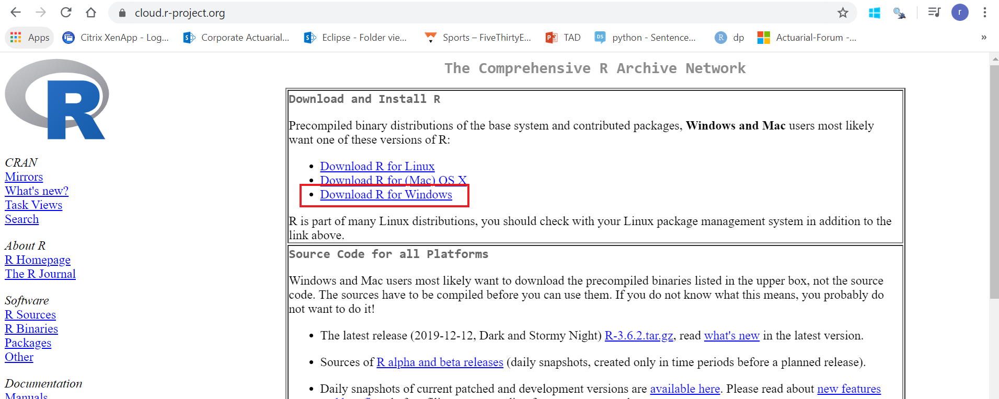
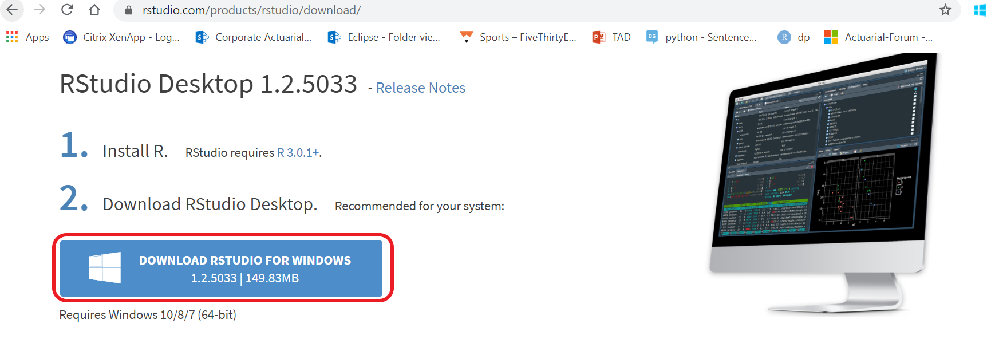

### Introduction

As we embark on our journey to integrate data science into actuarial work we need to first understand the programming languages we will use to carry out our analysis.  There are many open source programming languages that can be used to analyze data; among the most popular are `R` and `Python`.  While we will explore leveraging `Python` for data science in later material, we will initally focus on using `R` for Data Science.

As previously mentioned, R is an open source software that enables data analysis.  A consequence of this is there is a large community of developers continuously working to improve the software to increase functionality and efficiency.  The material presented by the Data Science Resouce Group will demonstrate many ways that `R` can be leveraged to extract more insights than with traditional `Excel` based approaches.  As individuals become more confortable with the R environment they will begin to see that `R` offers easy application of statistical & machine learning techniques and produces stunning -publication ready - visualizations.

While `R` is the software we will be leveraging for our analysis, developers have created an Integrated Development Environment (IDE) which gives a more practical and user-friendly interface which increases productivity by allowing a user to edit source code, debug code, and run executable. A more thorough break-down of the `RStudio` IDE will be provide after download instructions. We will be using `RStudio` to conduct our analysis.

### Download instructions

**1. Install `R` on our local machine.**  *Note: At this time there is no corporate support for a cloud based `R` instance.

+ Navigate to: https://cloud.r-project.org/
+ Select your OS



---

**2. Install `RStudio` on our local machine.**

`RStudio` runs *on-top* of `R` as such, **`R` needs to be installed before downloading and installing `RStudio`**

+ Navigate to: https://rstudio.com/products/rstudio/download/
+ Select your OS





---

### Exploring RStudio IDE

Since we are going to be using `RStudio` going forward, we should take some time to get more familiar with it.

After installing `R` and `RStudio` when `RStudio` is launched 4 panes will be displayed.

+ Editor

  + The **Editor** pane is where our source code will be located.  As we develop code to analyze data, we will be making edits to source code files.  

+ Console

  + The **console** is where code is evaluated.  There are two ways code can be evaluated:


  1. Directly in the Console.

      In some cases, we may wish to carry out ad-hoc calculations.  If we do not want to explicitly save the code to evaluate these calculations we can enter a command directly in the console.  The following code chunk shows a command which returns the string **hello World!**.  A common command that is entered into the console is `getwd()` which returns the working directory.  


```{r console_example, echo = T, eval = T}

print("Hello World!")

```


  2. Code from source code files
      
  The other way to **run** our code is to either select a portion (entire or subset) of the source code and use the short cut `Ctrl` & `Enter`.  This will send executable code from the source file to the console to run.  This is what we will be using unless there are adhoc calculations we wish to test.


+ Information

  + The **information** pane contains a few different tabs (**Files**, **Plots**, Packages, **Help**, and Viewer).  **Files** shows the working directory, **Plots** shows the plots generated by code, and **Help** provides documentation for functions you need more information for.


+ Environment

  + The environment window shows any variables that have been declared.  More details will be provided in later documentation.
  


